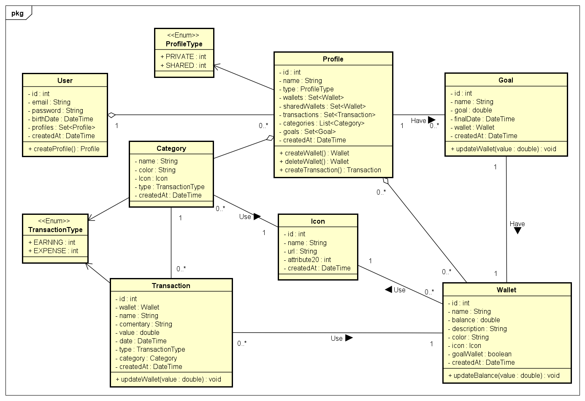
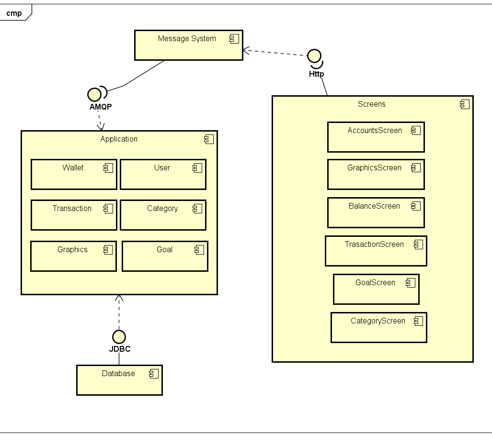
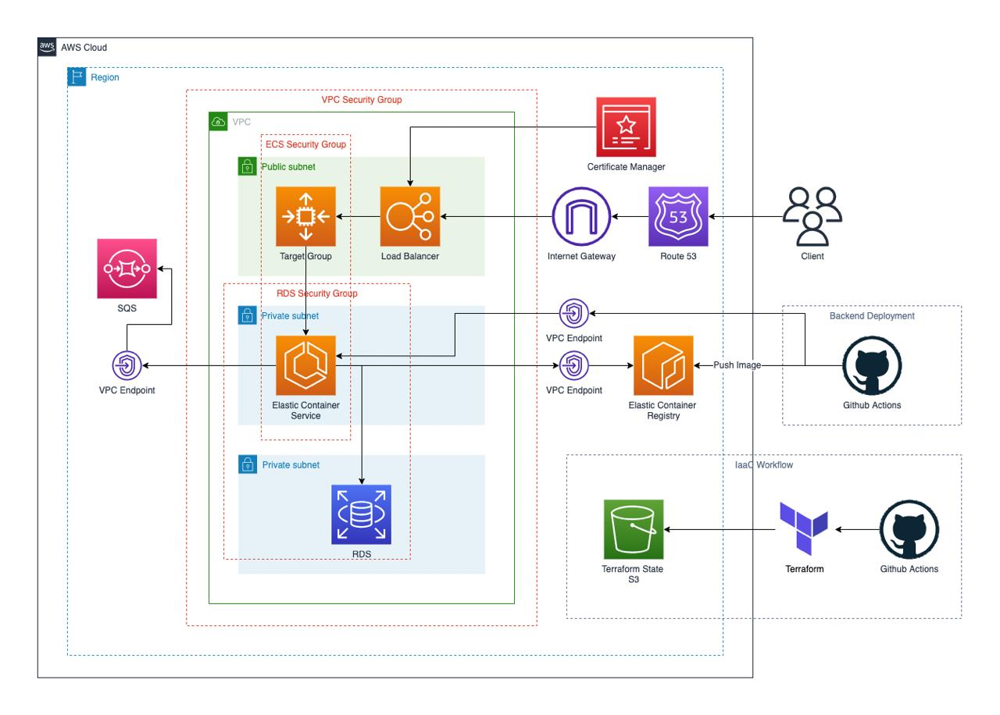
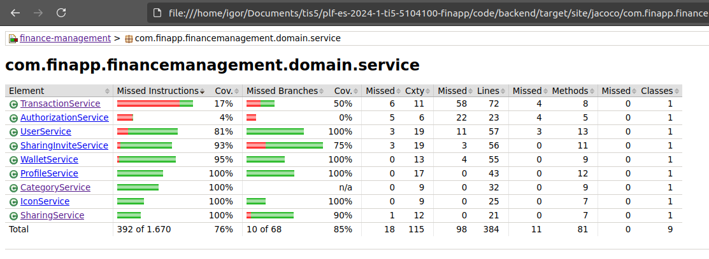

# FinApp

**Augusto Baldiotti Mendonça Alvares, augustobaldiotti@hotmail.com**

**Luana Gonçalves Fleury, luana.fleury4@gmail.com**

**Gabriel Estevão Nogueira Sobrinho, gensobrinho@hotmail.com**

**Daniel de Rezende Leão, danielrl.2000@gmail.com**

**Igor Pinheiro do Santos, igor.santos.1202168@sga.pucminas.br**

**Vinícius Gonzaga Guilherme, vgguilherme@sga.pucminas.br**

---

Professores:

**Hugo Bastos de Paula**

**Cleiton Silva Tavares**

**Pedro Pongelupe Lopes**

---

_Curso de Engenharia de Software, Unidade Praça da Liberdade_

_Instituto de Informática e Ciências Exatas – Pontifícia Universidade de Minas Gerais (PUC MINAS), Belo Horizonte – MG – Brasil_

---

**Resumo**

FinApp é uma aplicação web e mobile desenvolvida para solucionar o problema de gerenciamento financeiro compartilhado. A FinApp oferece uma plataforma colaborativa que permite a criação de uma "carteira" compartilhada para registro de despesas da dupla, fornecendo recursos como notificações de transações e relatórios de gastos. O objetivo principal deste projeto é simplificar o acompanhamento das finanças compartilhadas, mantendo os usuários informados sobre sua situação financeira.

---

## Histórico de Revisões

| **Data**         | **Autor**           | **Descrição**                                                                                                                                                                                                                                                                               | **Versão** |
| ---------------- | ------------------- | ------------------------------------------------------------------------------------------------------------------------------------------------------------------------------------------------------------------------------------------------------------------------------------------- | ---------- |
| **[11/04/2024]** | [Daniel Leão]       | [Atualização dos requisitos (2.1 e 2.2), das restrições e tecnologias (2.3 e 2.4), do diagrama de componentes e sua descrição (3.2), atualização das histórias de usuário e novas adicionadas, (3.1), adição da descrição no modelo de dados (3.3) e a remoção de alguns itens do template] | [X]        |
| **[23/04/2024]** | [Augusto Baldiotti] | [Atualização do requisito (3), ]                                                                                                                                                                                                                                                            | [X]        |
|  **[25/06/2024]** |  [Luana Fleury]                   | [Preenchimento da Avaliação (5.2)]                                                                                                                                                                                                                                                                                            |    2.0        |
|  **[27/06/2024]** |  [Luana Fleury]                   | [Versão final)]                                                                                                                                                                                                                                                                                            |    3.0        |

## SUMÁRIO

1. [Apresentação](#apresentacao "Apresentação")  
   1.1. Problema  
   1.2. Objetivos do trabalho  
   1.3. Definições e Abreviaturas  

2. [Requisitos](#requisitos "Requisitos")  
   ' 2.1. Requisitos Funcionais  
   2.2. Requisitos Não-Funcionais  
   2.3. Restrições Arquiteturais  
   2.4. Mecanismos Arquiteturais  

3. [Modelagem](#modelagem "Modelagem e projeto arquitetural")  
   3.1. Visão de Negócio  
   3.2. Visão Lógica  
   3.3. Modelo de dados  
   3.4. Modelo de Infraestrutura  

4. [Solução](#solucao "Projeto da Solução")  

5. [Avaliação](#avaliacao "Avaliação da Arquitetura")  
   5.1. Cenários  
   5.2. Avaliação  

6. [Referências](#referencias "REFERÊNCIAS") 

7. [Apêndices](#apendices "APÊNDICES") 

# 1. Apresentação

Vivemos em uma era onde a digitalização dos serviços financeiros está cada vez mais presente. A transição para o digital trouxe consigo uma necessidade crescente de ferramentas que permitam um controle eficiente e transparente das finanças pessoais e compartilhadas.

De acordo com uma pesquisa da McKinsey Global Institute, cerca de 2 bilhões de pessoas em todo o mundo não têm acesso a serviços bancários formais, e muitos outros estão procurando maneiras mais flexíveis e convenientes de gerenciar seu dinheiro. Além disso, a pandemia de COVID-19 acelerou a necessidade de soluções digitais, com um aumento de 72% no uso de aplicativos de fintech, segundo um relatório de 2020 da deVere Group.

## 1.1. Problema

A gestão financeira compartilhada pode ser complexa e estressante. A divisão equitativa das despesas, a contabilização precisa dos gastos e a garantia de que todos estejam pagando sua parte justa são tarefas difíceis de se realizar manualmente. Além disso, questões como quem pagou pela última compra de supermercado, quem deve a quem e quanto cada pessoa contribuiu para as contas do mês podem causar tensões desnecessárias.

Além disso, a falta de transparência e clareza nas finanças compartilhadas pode levar a mal-entendidos e conflitos. Sem um sistema eficaz para rastrear e dividir despesas, é fácil para os indivíduos sentirem que estão carregando um fardo financeiro injusto.

Em suma, o problema central que precisamos resolver é como tornar a gestão financeira compartilhada mais simples, transparente e justa, eliminando as dores de cabeça associadas à divisão de despesas.

## 1.2. Objetivos do trabalho

### Objetivo Geral

O objetivo principal deste projeto é desenvolver uma aplicação de gerenciamento financeiro compartilhado.

### Objetivos específicos

- Criar uma interface de usuário amigável: A aplicação deve ser fácil de usar, mesmo para aqueles que não estão familiarizados com a tecnologia. A interface deve ser simples, limpa e intuitiva.
- Transparência nas transações: A aplicação deve oferecer uma visão clara de todas as transações financeiras realizadas, garantindo que todos os usuários possam ver quem pagou e quanto cada pessoa deve.
- Carteiras privadas e compartilhadas: A aplicação deve permiter a criação de mais de uma carteira, com a possibilidade de escolha entre individual ou compartilhada.
- Facilitar a criação de metas financeiras: A aplicação deve permitir aos usuários definir metas financeiras e acompanhar seu progresso em direção a elas.
- Desenvolver um sistema de notificações por transações realizadas: Os usuários devem receber notificações sempre que uma transação for realizada, mantendo-os informados sobre suas finanças em tempo real.
- Categorias: A aplicação deve permitir a criação de categorias personalizadas que podem ser atribuídas a cada transação realizada.

## 1.3. Definições e Abreviaturas

- RF - Requisito Funcional
- RNF - Requisito não Funcional

# 2. Requisitos

## 2.1. Requisitos Funcionais

| **ID** | **Descrição**                                                                                                                                                                                    | **Prioridade** | **Plataforma** |
| ------ | ------------------------------------------------------------------------------------------------------------------------------------------------------------------------------------------------ | -------------- | -------------- |
| RF001  | Gerenciar metas: Os usuários devem conseguir definir, atualizar e acompanhar metas financeiras personalizadas, proporcionando uma visão clara de seu progresso em direção a elas.                | Desejável      | _mobile_       |
| RF002  | Gerenciar categorias: Os usuários devem conseguir efetuar a criação de categorias personalizadas para melhor organização e rastreamento dos gastos.                                              | Essencial      | _mobile_       |
| RF003  | Compartilhamento de carteiras: Os usuários devem ser capazes de compartilhar carteiras com outros usuários.                                                                                      | Essencial      | _mobile_       |
| RF004  | Histórico de transações: Os usuários devem conseguir manter um registro completo de todas as transações realizadas, permitindo aos usuários revisar seu histórico financeiro a qualquer momento. | Essencial      | _mobile_       |
| RF005  | Notificações de transações: Os usuários devem receber notificações por email em tempo real sempre que uma transação for realizada.                                                                         | Essencial      | _mobile_       |
| RF006  | Comentários em transações: Os usuários devem ser capazes de deixar comentários em transações individuais.                                                                                        | Opcional       | _mobile_       |
| RF007  | Geração de relatórios de transações: O usuário deve ser capaz de gerar relatórios sobre as transações.                                                                                           | Essencial      | _web_          |
| RF008  | Gerenciar usuário: Os usuários devem conseguir se registrar e fazer login de forma segura, mantendo suas informações pessoais protegidas.                                                        | Essencial      | _mobile_       |
| RF009  | Visualização de metas: Os usuários visualizar suas metas financeiras e o progresso em direção a elas na versão web.                                                                              | Essencial      | _web_          |
| RF010  | Visualização de categorias: Os usuários devem ser capazes de visualizar as categorias personalizadas criadas para melhor organização e rastreamento dos gastos e recebimentos.                   | Essencial      | _web_          |
| RF011  | Visualização de carteiras compartilhadas: Os usuários devem ser capazes de visualizar as carteiras que foram compartilhadas com eles.                                                            | Essencial      | _web_          |
| RF012  | Visualização do histórico de transações: Os usuários devem conseguir exibir um registro completo de todas as transações realizadas, permitindo aos usuários revisar seu histórico financeiro.    | Desejável      | _web_          |
| RF013  | Notificações de transações: Os usuários devem poder visualizar notificações sobre transações realizadas.                                                                                         | Desejável      | _web_          |
| RF014  | Visualização de comentários em transações: Os usuários devem ser capazes de visualizar os comentários deixados em transações individuais.                                                        | Opcional       | _web_          |
| RF015  | Login de usuários: Os usuários devem ser capazes de fazer o login de forma segura no ssitema web (Cadastro apenas pelo sistema mobile).                                                          | Essencial      | _web_          |

## 2.2. Requisitos Não-Funcionais

| **ID** | **Descrição**                                                                                                                                                                     |
| ------ | --------------------------------------------------------------------------------------------------------------------------------------------------------------------------------- |
| RNF001 | A aplicação deve ser compatível e totalmente funcional nos navegadores mais populares, incluindo Google Chrome (v.124) e Safari (v.17). |
| RNF002 | A aplicação deve ter um tempo de resposta máximo de 5 segundos para todas as funcionalidades principais. (Observação: consideramos funcionaidades principais aquelas que foram definidas com prioridade "Essencial" na tabela de requisitos funcionais.)                                                      |
| RNF003 | A aplicação deve ser capaz de cadastrar uma transação em até 15 até segundos.                                                                                          |
| RNF004|  A aplicação deve ser capaz de funcionar no IOS (v.17.0) e no Android (v.14.0).                                                                                         |
| RNF005 | A aplicação deve ter uma cobertura de testes unitários de 50%.                                                                                                     |

## 2.3. Restrições Arquiteturais

As restrições impostas ao projeto que afetam sua arquitetura são:

- A aplicação frontend deverá ser desenvolvida em React.JS;
- A aplicação mobile deverá ser desenvolvida com React Native;
- A aplicação frontend deverá ser testada utilizando Cypress;
- A aplicação mobile deverá ser testada utilizando Maestro;
- O sistema backend deverá utilizar Java com Springboot;
- O sistema backend deverá ser testado utilizando JUnit;
- A comunicação da API deve seguir o padrão RESTful;
- O servidor de mensageria utilizado na aplicação deve ser AWS SQS;
- O ambiente de desenvolvimento será no docker;
- O ambiente de produção estará na nuvem.

## 2.4. Mecanismos Arquiteturais

| **Análise**       | **Design**               | **Implementação**      |
| ----------------- | ------------------------ | ---------------------- |
| Persistência      | SQL                      | MySQL                  |
| Front end         | em Componentes           | React/React Native     |
| Back end          | MVC                      | Springboot             |
| Integração        | Mensageria               | AWS SQS                |
| Teste de Software | Orientado a casos de uso | Cypress/Maestro/JUnit |
| Deploy            | Containers               | Docker                 |

# 3. Modelagem e Projeto Arquitetural

O Front end será construido em React e o Mobile em React Native. O Front End e Mobile iram se comunicar com o Back End por meio de uma API HTTP criada, o Back End terá envio de mensagens por meio do AWS Simple Message Queue e todo ele será conteinerizado utilizando o Docker.
Por fim, os dados ficarão salvos em nosso Banco de Dados que será em MySQL

## 3.1. Visão de Negócio (Funcionalidades)

1. O sistema deve permitir aos usuários definir, atualizar e acompanhar metas financeiras personalizadas.
2. O sistema deve permitir a criação de categorias personalizadas para melhor organização e rastreamento dos gastos.
3. O sistema deve permitir o compartilhamento de carteiras entre os usuários.
4. O sistema deve manter um registro completo de todas as transações realizadas.
5. O sistema deve enviar notificações em tempo real sempre que uma transação for realizada.
6. O sistema deve gerar relatórios sobre as transações.
7. O sistema deve permitir que os usuários se registrem e façam login de forma segura.
8. O sistema deve permitir aos usuários visualizar as categorias personalizadas criadas para melhor organização e rastreamento dos gastos e recebimentos na plataforma web.
9. O sistema deve permitir aos usuários visualizar as carteiras que foram compartilhadas com eles na plataforma web.
10. O sistema deve permitir aos usuários visualizar notificações sobre transações realizadas na plataforma web.
11. O sistema deve permitir que os usuários façam login na plataforma web.
12. O sistema deve ter um tempo de resposta máximo de 5 segundos para todas as funcionalidades.
13. O sistema deve ser fácil de usar, com uma interface intuitiva e instruções claras.
14. O sistema deve ser projetado de forma a facilitar atualizações e manutenção futuras.
15. O sistema deve funcionar em diferentes sistemas operacionais e dispositivos.

### Histórias de Usuário

Como Usuário, eu quero poder convidar meu amigo para compartilhar uma mesma carteira, para que possamos gerenciar nossas finanças conjuntas de maneira eficiente.

Como Usuário, eu quero poder visualizar e gerenciar minhas metas financeiras, para que eu possa ter um controle melhor sobre meus objetivos de economia e gastos.

Como Usuário, eu quero poder gerar relatórios referentes às transações financeiras das carteiras que tenho acesso, para que eu possa analisar meu comportamento financeiro e fazer ajustes conforme necessário.

Como Usuário, eu quero poder visualizar as transações feitas pela pessoa que tem uma carteira compartilhada comigo, para que eu possa ficar informado sobre a atividade da conta e gerenciar meu orçamento adequadamente.

Como Usuário, eu quero poder receber notificações referente às transações realizadas nas carteiras compartilhadas que possuo, para que eu possa acompanhar em tempo real os movimentos financeiros e manter-me atualizado.

Como Usuário, eu quero poder definir as transações com uma tag, para facilitar a busca e a filtragem em consultas.

Como Usuário, eu quero poder deixar comentários em transações, para que eu possa averiguar de onde essas transações estão vindo com mais precisão.

Como Usuário, eu quero configurar alertas para quando estiver próximo de atingir os limites de minhas metas de gasto, para evitar ultrapassá-los e manter meu orçamento sob controle.

## 3.2. Visão Lógica

### Diagrama de Classes

**Figura 2 – Diagrama de classes. Fonte: o próprio autor.**

**User:** Armazena dados dos usuários e pode criar perfis.
**Profile:** Detém informações de perfil e pode ser privado ou compartilhado. Relaciona-se com Wallets, Transactions, Categories e Goals.
**ProfileType:** Enumeração que define os tipos de perfil.
**Category:** Categorias para transações, com nome, cor, ícone e tipo.
**TransactionType:** Enumeração que distingue entre ganhos e despesas.
**Transaction:** Registra transações, ligadas a Wallets e Categories.
**Icon:** Define ícones usados no sistema.
**Goal:** Representa metas financeiras associadas a Wallets.
**Wallet:** Representa carteiras financeiras que pertencem a um perfil e podem ter objetivos.

### Diagrama de componentes

**Figura 3 – Diagrama de Componentes. Fonte: Daniel Leão.**

Conforme o diagrama apresentado acima as entidades do nosso sistemas estão descritas a seguir:

**Message System**
Este componente utiliza uma abordagem de orientação a mensagens/eventos e facilita a comunicação assíncrona e o acoplamento solto entre outros componentes do sistema. Através do protocolo HTTP, ele permite a comunicação com as interfaces do usuário e utiliza o RabbitMQ como seu sistema de mensagens.

**Application**
A camada de aplicação segue uma arquitetura em camadas, abrigando a lógica de negócios central e processando as requisições dos usuários. Esta camada é modularizada em subcomponentes como Wallet, User e Transaction, que gerenciam diferentes aspectos das funcionalidades financeiras do sistema.

**Database**
O componente de banco de dados gerencia a persistência e a integridade dos dados do sistema. A conexão entre o banco de dados e a camada de aplicação é feita por meio do JDBC, indicando a utilização de um sistema de gerenciamento de banco de dados relacional.

**Screens**
As telas formam a interface do usuário e são o ponto de contato entre o usuário e a aplicação. Seguindo o modelo MVC, cada tela é desenhada para facilitar interações específicas na interface do usuário, como gerenciamento de contas, visualização de transações e acompanhamento de metas financeiras.

## 3.3. Modelo de dados

 ")

**Figura 4 – Diagrama de Entidade Relacionamento (ER) - exemplo. Fonte: Vinicius Gonzaga.**

**User:** Armazena informações do usuário, como nome, e-mail, senha e data de nascimento.

**Profile:** Relaciona-se com a tabela User e contém detalhes sobre perfis de usuário individuais, incluindo o tipo de perfil.

**Wallet:** Liga-se ao perfil e guarda informações sobre carteiras financeiras, como nome, descrição, cor e saldo.

**Transaction:** Registra as transações financeiras, ligadas tanto a uma Wallet quanto a um Profile, e categorizadas em Expense_category ou Earning_category.

**Expense_category e Earning_category:** Listam as categorias de despesas e ganhos, respectivamente, associadas a um perfil e podem estar vinculadas a transações específicas.

**Icon:** Usado para armazenar ícones para serem usados com Wallet ou categorias de transações.

**Goals:** Registra metas financeiras relacionadas a uma carteira, com campos para nome, objetivo financeiro, data final e data de criação.

**Sharing:** Gerencia o compartilhamento de carteiras entre usuários, identificando o proprietário, o convidado e a carteira compartilhada.

## 3.4. Modelo de Infraestrutura

**Figura 5 – Diagrama de Infraestrutura - Fonte: Vinicius Gonzaga.**

# 4. Projeto da Solução

**Tela inicial:** Primeira tela ao entrar no aplicativo, com botões para "entrar" ou "registrar" uma conta.
--------------------------------------------------------------------------------------------------------------------------

**Tela de cadastro:** Tela para criar uma conta com os campos de nome, usuário, e-mail, senha e confirmação de senha. 
--------------------------------------------------------------------------------------------------------------------------

**Tela de login:** Tela para realizar login com os campos de e-mail e senha.
--------------------------------------------------------------------------------------------------------------------------

**Menu bottom sheet:** Bottom sheet de Menu, onde é possível acessar os perfis ou convites do usuário. 
--------------------------------------------------------------------------------------------------------------------------

**Tela de Perfis:** Tela para criar, deletar ou acessar perfis.
--------------------------------------------------------------------------------------------------------------------------

**Tela após escolha de perfil:** Tela inicial de perfil.
--------------------------------------------------------------------------------------------------------------------------

**Tela de transações:** Tela de histórico de transações.
--------------------------------------------------------------------------------------------------------------------------

**Tela de categorias:** Tela para gerenciar categorias.
--------------------------------------------------------------------------------------------------------------------------

**Tela de criar carteira:** Tela para criar nova carteira.
--------------------------------------------------------------------------------------------------------------------------

**Tela de editar carteira:** Tela para criar editar carteira.
--------------------------------------------------------------------------------------------------------------------------

**Tela de usuário:** Tela com informações como nome, nome de usuário e e-mail.
--------------------------------------------------------------------------------------------------------------------------
# Telas Web

**Tela Inicial:** Resumo da conta, categorias por perfil e informações da conta.
--------------------------------------------------------------------------------------------------------------------------

**Tela de Login**
--------------------------------------------------------------------------------------------------------------------------

**Tela de Perfis:** Visualização de carteiras por perfil e Emissão de relatório.

# 5. Avaliação da Arquitetura

## 5.1. Cenários

# Cenários de Teste

## Cenário de Teste 1: RNF001
1. Abrir a aplicação no Google Chrome (v.124).
2. Navegar por todas as funcionalidades principais da aplicação.
3. Repetir os passos 1 e 2 para o Safari (v.17).
- **Resultado esperado**: A aplicação deve ser totalmente funcional em ambos os navegadores.

## Cenário de Teste 2: RNF002
1. Acessar uma funcionalidade principal da aplicação.
2. Medir o tempo de resposta da funcionalidade.
- **Resultado esperado**: O tempo de resposta não deve exceder 5 segundos.

## Cenário de Teste 3: RNF003
1. Iniciar o processo de cadastro de uma transação.
2. Completar o cadastro da transação.
- **Resultado esperado**: O processo de cadastro deve ser concluído em até 15 segundos.

## Cenário de Teste 4: RNF004
1. Instalar e abrir a aplicação no Android (v.14.0).
2. Navegar por todas as funcionalidades principais da aplicação.
3. Repetir os passos 1 e 2 para o IOS (v.17.0).
- **Resultado esperado**: A aplicação deve funcionar corretamente em ambos os sistemas operacionais.

## Cenário de Teste 5: RNF005
1. Executar todos os testes unitários da aplicação.
2. Calcular a porcentagem de cobertura dos testes unitários.
- **Resultado esperado**: A cobertura de testes unitários deve ser de pelo menos 50%.

## 5.2. Avaliação

**Atributo de Qualidade:** | Compatibilidade (Web)
| -------------------------- | ----------------------------------------------------------------------------------------------------------------------------------------------------------------------------------------------------------------------------------------------------------------------
| **Requisito de Qualidade** | A aplicação deve ser compatível e totalmente funcional nos navegadores mais populares, incluindo Google Chrome (v.124) e Safari (v.17).
| **Preocupação:**           | A aplicação deve funcionar corretamente nos navegadores mais usados.
| **Cenários(s):**           | Cenário 1
| **Ambiente:**              | Sistema em operação normal
| **Estímulo:**              | Usuário acessa a aplicação através do Google Chrome e Safari.
| **Mecanismo:**             | Usuário acessa a aplicação e realiza login em ambos os navegadores.
| **Medida de Resposta:**    | A aplicação funciona corretamente e sem erros nos navegadores especificados.

**Evidências dos testes realizados**
* [Google Chrome](../evidence/RNF001Chrome.mov)
* [Safari](../evidence/RNF001Safari.mov)

--------------------------------------------------------------------------------------------------------------------------

**Atributo de Qualidade:** | Desempenho
| -------------------------- | ----------------------------------------------------------------------------------------------------------------------------------------------------------------------------------------------------------------------------------------------------------------------
| **Requisito de Qualidade** | A aplicação deve ter um tempo de resposta máximo de 5 segundos para todas as funcionalidades principais.
| **Preocupação:**           | As funcionalidades principais da aplicação devem responder rapidamente.
| **Cenários(s):**           | Cenário 2
| **Ambiente:**              | Sistema em operação normal
| **Estímulo:**              | Usuário utiliza as funcionalidades principais da aplicação.
| **Mecanismo:**             | Consideramos "funcionalidades principais" como aquelas definidas com prioridade essencial na tabela de requisitos funcionais. Send elas: Gerenciamento de categorias (mobile), Histórico de transações (mobile), Visualização de categorias (Web), Login de usuários (Web) e Gerenciar usuários (mobile)
| **Medida de Resposta:**    | Todas as funcionalidades principais respondem em até 5 segundos.

**Evidências dos testes realizados:**
* [Gerenciamento de categorias (mobile)](../evidence/RNF002/GerenciamentoCategorias.mp4)
* [Histórico de transações (mobile)](../evidence/RNF002/HistoricoTransacoes.mp4)
* [Login de Usuários Web](../evidence/RNF002/RNF002WebLogin.mov)
* [Visualização de categorias Web](../evidence/RNF002/RNF002VCategoriasWeb.mov)
* [Gerenciar usuários (mobile)](../evidence/RNF002/GerenciarUsuario.mp4)

--------------------------------------------------------------------------------------------------------------------------

**Atributo de Qualidade:** | Desempenho
| -------------------------- | ----------------------------------------------------------------------------------------------------------------------------------------------------------------------------------------------------------------------------------------------------------------------
| **Requisito de Qualidade** | A aplicação deve ser capaz de cadastrar uma transação em até 15 até segundos.
| **Preocupação:**           | O cadastro de transações deve ser rápido.
| **Cenários(s):**           | Cenário 3
| **Ambiente:**              | Sistema em operação normal
| **Estímulo:**              | Usuário tenta cadastrar uma transação.
| **Mecanismo:**             | Usuário acessa a aplicação e cadastra uma transação.
| **Medida de Resposta:**    | Uma transação é cadastrada em até 15 segundos.

**Evidências dos testes realizados:**
[RNF003](../evidence/RNF003.mp4)

--------------------------------------------------------------------------------------------------------------------------

**Atributo de Qualidade:** | Compatibilidade (Mobile)
| -------------------------- | ----------------------------------------------------------------------------------------------------------------------------------------------------------------------------------------------------------------------------------------------------------------------
| **Requisito de Qualidade** | A aplicação deve ser capaz de funcionar no IOS (v.17.0) e no Android (v.14.0).
| **Preocupação:**           | A aplicação deve ser compatível com os sistemas operacionais móveis mais usados.
| **Cenários(s):**           | Cenário 4
| **Ambiente:**              | Sistema em operação normal
| **Estímulo:**              | Usuário acessa a aplicação através de um dispositivo IOS e Android.
| **Mecanismo:**             | Usuário acessa a aplicação e realiza login no IOS e Android.
| **Medida de Resposta:**    | A aplicação funciona corretamente e sem erros nos sistemas especificados.

**Evidências dos testes realizados:**
- [Android](../evidence/RNF004Android.mov)
- [IOS](../evidence/RNF004IOS.mov)
 
 --------------------------------------------------------------------------------------------------------------------------
 
**Atributo de Qualidade:** | Testabilidade
| -------------------------- | ----------------------------------------------------------------------------------------------------------------------------------------------------------------------------------------------------------------------------------------------------------------------
| **Requisito de Qualidade** | A aplicação deve ter uma cobertura de testes unitários de 50%.
| **Preocupação:**           | Garantir que a qualidade do código da aplicação.
| **Cenários(s):**           | Cenário 5
| **Ambiente:**              | Sistema em fase de desenvolvimento
| **Estímulo:**              | Desenvolvedor escreve testes unitários para a aplicação.
| **Mecanismo:**             | Koverage
| **Medida de Resposta:**    | A cobertura de testes unitários da aplicação é de pelo menos 50%.

**Evidências dos testes realizados:**

**Considerações sobre a arquitetura:**

| **Riscos:**                  | Não existe |
| ---------------------------- | ---------- |
| **Pontos de Sensibilidade:** | Não existe |
| _ **Tradeoff** _ **:**       | Não existe |

# 6. REFERÊNCIAS

**[1]** - _ELMASRI, Ramez; NAVATHE, Sham. **Sistemas de banco de dados**. 7. ed. São Paulo: Pearson, c2019. E-book. ISBN 9788543025001._

**[2]** - _COPPIN, Ben. **Inteligência artificial**. Rio de Janeiro, RJ: LTC, c2010. E-book. ISBN 978-85-216-2936-8._

**[3]** - _CORMEN, Thomas H. et al. **Algoritmos: teoria e prática**. Rio de Janeiro, RJ: Elsevier, Campus, c2012. xvi, 926 p. ISBN 9788535236996._

**[4]** - _SUTHERLAND, Jeffrey Victor. **Scrum: a arte de fazer o dobro do trabalho na metade do tempo**. 2. ed. rev. São Paulo, SP: Leya, 2016. 236, [4] p. ISBN 9788544104514._

**[5]** - _RUSSELL, Stuart J.; NORVIG, Peter. **Inteligência artificial**. Rio de Janeiro: Elsevier, c2013. xxi, 988 p. ISBN 9788535237016._

**[6]** - _CHANDLER, Simon. Coronavirus Drives 72% Rise In Use Of Fintech Apps. Forbes, 30 de março de 2020._ Disponível em: https://www.forbes.com/sites/simonchandler/2020/03/30/coronavirus-drives-72-rise-in-use-of-fintech-apps/?sh=55a314866ed2.

**[7]** - _MCKINSEY GLOBAL INSTITUTE. The promise of digital finance. McKinsey & Company_
Disponível em: https://www.mckinsey.com/mgi/overview/in-the-news/the-promise-of-digital-finance.

# 7. APÊNDICES

URL do repositório: https://github.com/ICEI-PUC-Minas-PPLES-TI/plf-es-2024-1-ti5-5104100-finapp.git
